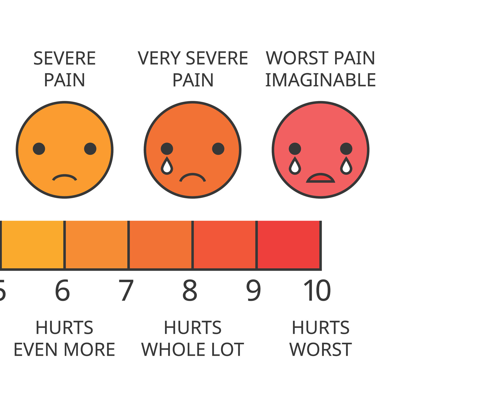

# Automatic Deployments Relieve Pain and Suffering

## Vivint's Deployment Pains and how Kubernetes, Helm, Helmfile, and Codefresh made deployments easy(er)

https://github.com/benmathews/SLCKubernetesPresentation
https://bit.ly/3aNIiZq

---
# **Automatic Deployments**

---

# **Relieve Pain and Suffering**

---

# Vivint's Deployment Pains and how

- Kubernetes
- Helm
- Helmfile,
- and Codefresh

...made deployments easy(er)

---

# Ben Mathews

ben@mathews2000.com
ben.mathews@vivint.com

I play with the latest CNCF toys.

---

# Jared Meeker

jared@meekers.org
jared.meeker@vivint.com
https://github.com/jlmeeker

All things automation, with a smattering of Ops-related development and a healthy dose of tech-related fun!

---

# Who is Vivint (Business)

- We are public now! VVNT
- A leading smart home company in North America
- An integrated smart home system w/ security monitoring
- More than 1.5 million customers

---

# Who is Vivint (Technical)

- 100+ Kubernetes nodes across 4 clusters (mix of on-prem and cloud)
- 4700+ Deployments, Daemonsets, Statefulsets, Cronjobs
- 8K+ pods
- ~1.5 billion messages per day from homes (at peak nearly 25k messages/second)
- 5K messages/second in mobile traffic
- Multiple releases a week

---

# Manual Install On VMs

## 2017

- Large installation of VMs
- Deployment was a 3-4 hour, completely manual process
- Problems
- Pain

<!-- 
* Software was installed on 40 VMs. 
* We had a salt configuration for them but used it badly.
* Deployment was a completely manual process. 
* It consisted of draining nodes, manually moving traffic around in our F5, we often did hot patching
* In the pets vs cattle analogy we had a lot of poorly behaved pets. 
* Even when things went well we tolerated minor service disruptions to do a deploy.
* We were so unconfident that we could deploy that any developer who had code in the release was REQUIRED to be sitting in the area next to the ops guys during the release period.
-->

---

# Manual Kubernetes

## Jan 2018

- Jan 2018 - First Kubernetes in production
- Early 2019 - shut down the last of the old VM infrastructure

<!-- 
* We knew we had to get better. 
* Kubernetes was quite new 
* to learn and understand Kubernetes
* to break all the hard coded paths and other assumptions
* to harden our code
 -->

---

# Manual Kubernetes

## Great

- Deployment faster - under an hour
- More reliable
- Scheduling
- Restart failed processes
- Resource caps
- All the great K8S stuff

---

# Manual Kubernetes

## But

- But still manual
- Numerous mistakes
  - Wrong image tag
  - Forgetting to add new ENV parameters
  - Etc.

---

# Manual Kubernetes is a maintenance nightmare

- Hand editing YAML configs
- Syncronizing similar deployments across beta and production
- Wanted multiple dev and QA environments
  - Impossible w/ handcrafted YAML

---

# Helm

- Config as code
- Updates/Rollbacks
- Templating

---

# Helm public charts

---

# Helm

## 2018/2019

## Great

- Faster - half hour
- Deployments more reliable

---

# Late 2019

Finished converting everything to deploy with Helm charts

## But

- Still manual deployments
- Still mistakes

<!-- Mostly automated process also mean you can break production more completely and do it quickly. We once deployed to production with the beta configuration. It didn't go well. -->

---

## But

- Manual workflow
  - Editing wiki pages
  - Slack messages
  - Miscomunication and mistakes == deployment mistakes and outages
- Still too slow

---

# Product Research

- Identified 40+ different CD products
- Reviewed them for
  - Ability to use existing Helm and Jenkins work
  - Logging and Audit trails
  - Okta, Bitbucket Server integration
  - GitOps style
  - Ease of use

---

# The winners

- ArgoCD
- FluxCD
- CodeFresh

---

# The winners

- Argo Flux
- CodeFresh

---

# Codefresh pipeline

- Access control
- Audit logs
- Repeatable, scriptable workflow
- Flexible

---

# Helmfile

- Alpha
- Not many stars
- No website
- But it works
  - Really well

- Closed the config as code loop

<!-- Dustin Van Buskirk suggested Helmfile -->
<!-- I wrote a script to pull in our existing values files and had it working within days. The hardest part was training our QA staff that drive our release process. -->

---

# Late 2019

Codefresh, Helm, and Helmfile have been working well.

## Great

- Fast deploys - 5 minutes
- More reliable than ever before
- Slack notifications

---

# But

- Still not fast enough
- Not enough visibility if deployment succeded

---

# Mid 2020

## Reliability

Partial rollout of:

- Liveness Probes
- Readiness Probes
- Helm Tests

## Speed

More intelligence around deployment to make them faster

---

# Post Deployment

Verifying our deployments involves various tools and processes; some automated and some not.

- Automated
  - helm
  - internal tooling (automated tests)
- Manual
  - kubectl rollout status
  - kubectl get deployments
  - internal tooling (manual tests)

<!-- We still have too much manual verification.  We're working on it and making great progress. -->
<!-- Deployments still require a manual, visual check that  -->

---

# When Things Go Bad (and they will)

- Monitoring Tools
  - bluematador
  - prometheus/alertmanager
  - grafana
  - ELK Stack
  - kubectl

<!-- In addition to the tools listed above we have a series of chat bots that monitor alerts and will retrieve and display additional, pertinent information surrounding our alerts. These are most frequently in the form of time-series charts that show various aspects of our platform in the few hours leading up to the alert. -->

---

# Working on

- Helm3

TODO - add more about how we compelete the loop w/ probes and helm test
How blue matador alerts to slack

---

https://github.com/benmathews/SLCKubernetesPresentation
https://bit.ly/3aNIiZq

