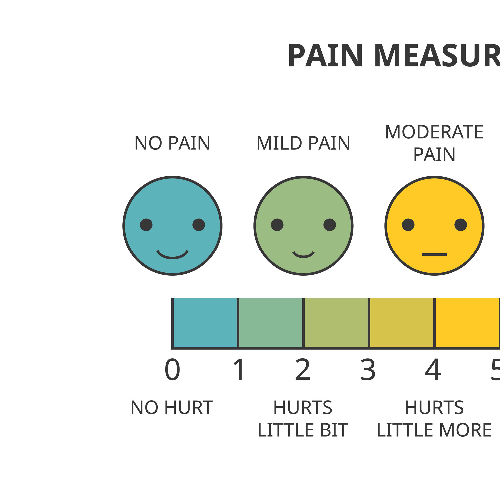
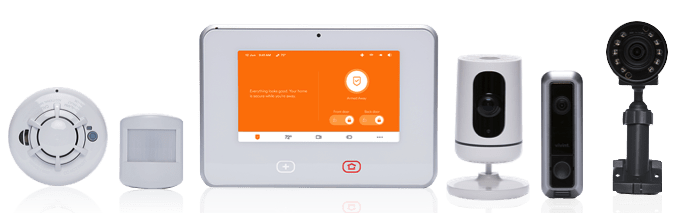
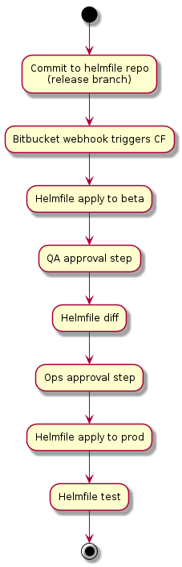
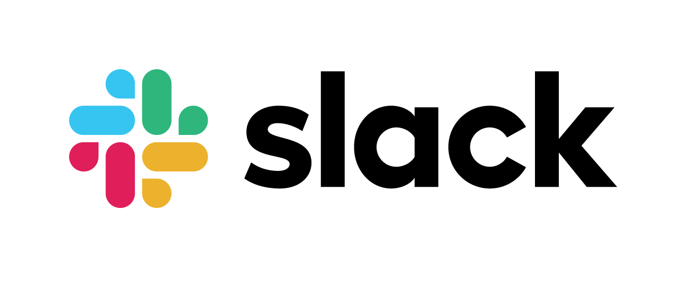

# Automatic Deployments Relieve Pain and Suffering

## Vivint's Deployment Pains and how Kubernetes, Helm, Helmfile, and Codefresh made deployments easy(er)

https://github.com/benmathews/SLCKubernetesPresentation
https://bit.ly/3aNIiZq

---
# **Automatic Deployments**

---

# **Relieve Pain and Suffering**

---

# Vivint's Deployment Pains and how

- Kubernetes
- Helm
- Helmfile,
- and Codefresh

...made deployments easy(er)

---

# Ben Mathews

ben@mathews2000.com
ben.mathews@vivint.com

I play with the latest CNCF toys.

---

# Jared Meeker

jared@meekers.org
jared.meeker@vivint.com

All things automation, with a smattering of Ops-related development and a healthy dose of tech-related fun!

---

# Who is Vivint (Business)

- We are public now! VVNT
- A leading smart home company in North America
- An integrated smart home system w/ security monitoring
- More than 1.5 million customers

---

# Who is Vivint (Technical)

- 100+ Kubernetes nodes across 4 clusters (mix of on-prem and cloud)
- 4700+ deployments, daemonsets, statefulsets, cronjobs
- 8K+ pods
- ~1.5 billion messages per day from homes (at peak nearly 25k messages/second)
- 5K messages/second in mobile traffic
- Multiple releases a week

---

# Manual Install On VMs

## 2017

- Large installation of VMs
- Deployment was a 3-4 hour, completely manual process
- Problems
- Pain

<!-- 
* Software was installed on 40 VMs. 
* We had a salt configuration for them but used it badly.
* Deployment was a completely manual process. 
* It consisted of draining nodes, manually moving traffic around in our F5, we often did hot patching
* In the pets vs cattle analogy we had a lot of poorly behaved pets. 
* Even when things went well we tolerated minor service disruptions to do a deploy.
* We were so unconfident that we could deploy that any developer who had code in the release was REQUIRED to be sitting in the area next to the ops guys during the release period.
-->

---

# Manual Install on Kubernetes

## Jan 2018

- Jan 2018 - First Kubernetes in production
- Early 2019 - shut down the last of the old VM infrastructure

<!-- 
* We knew we had to get better. 
* Kubernetes first release was 2015 and it was still raw
* Jared figured out how to install and maintain a Kubernetes cluster
* I figured out how to use use Kubernetes
* Because it was so new we had lots of what I'll call adventures
  * bleeding edge kernel requirments
  * broken network drivers
  * obscure configuration issues
* to break all the hard coded paths and other assumptions
* to harden our code
 -->

---

# Manual Install on Kubernetes

## Great

- Deployment faster - under an hour
- More reliable
- Scheduling
- Restart failed processes
- Resource caps
- All the great K8S stuff

---

# Manual Install on Kubernetes

## But

- But deployment was still manual (YAML editing)
- Numerous mistakes
  - Wrong image tag
  - Forgetting to add new ENV parameters
  - Etc.

---

# Manual Install on Kubernetes

## Multiple environments

- Hand editing YAML configs
- Syncronizing similar deployments across beta and production
- Wanted multiple dev and QA environments
  - Impossible w/ handcrafted YAML

---

# Something better

- Config as code
- Templating

<!-- 
* At the time there was at least three options that appeared to meet our needs
* Fortunately we picked the winner
 -->

---

# Helm

- Golang template
- Need to understand Kubernetes and a bit of programming
- Well supported by the community
- Solved all of our problems
  - Though it created some more

---

# Helm public charts

<!-- 
* Because of the wide adoption, there are corporate and community built charts for just about every public piece of software.
* They aren't always perfect, but at the least, serve as a great starting point.
 -->

---

# Helm Install

## 2018/2019

## Great

- Faster - half hour
- Deployments more reliable

---

# Helm Install

## Late 2019

Finished converting everything to deploy with Helm charts

## But

- Still manual steps in deployments
- Still mistakes

 

<!-- 
* A mostly automated process mean you can break production quickly and completely.
* We once deployed to production with the beta configuration. It didn't go well.
-->

---

# Helm Install

## But

- Manual workflow
  - Editing wiki pages
  - Slack messages
  - Miscomunication and mistakes
  - Outages
- Still too slow

 

<!-- The too slow complaint will probably continue until our deployment times are measured in milliseconds. -->

---

# Product Research

- Identified 40+ different CD products
- Reviewed them for
  - Ability to use existing Helm and Jenkins work
  - Logging and Audit trails
  - Okta, Bitbucket Server integration
  - GitOps style
  - Ease of use

---

# The winners

- ArgoCD
- FluxCD
- CodeFresh

---

# The winners

- Argo Flux
- CodeFresh

---

# Helmfile

- Alpha
- Not many stars
- No website
- But it works
  - Really well
- Closed the config as code loop

<!-- Dustin Van Buskirk suggested Helmfile
I wrote a script to pull in our existing values files and had it working within days. 
The hardest part was training our QA staff that drive our release process.
IMO If you are using Helm, you should be using Helmfile
 -->

---

# Codefresh pipeline

- Access control
- Audit logs
- Repeatable, scriptable workflow
- Flexible

---

# Fully Automatic Install

## Late 2019

Codefresh, Helm, and Helmfile have been working well.

## Great

- Fast deploys - 5 minutes
- More reliable than ever before
- Slack notifications

---

# Fully Automatic Install

## But

- Still not fast enough
- Not enough visibility if deployment succeded

---

# Mid 2020

## Reliability

Partial rollout of:
- Liveness Probes
- Readiness Probes
- Helm Tests

## Speed

More intelligence around deployment to make them faster

---

# Post Deployment

Anyone that has worked with Kubernetes and Helm knows that just running some commands doesn't always have the result you were expecting.  We have quite a few tools at our disposal for verifying our deployments and we'll be coving the major ones.  However, a few things to note:

- Bugs are inevitable
- Expect things to break
- Know your environment and the tools available
- No matter how much care and attention we give them, computers will do their best to make us miserable

---

# Most Common Problems

- Helm chart broken / incomplete
  - missing pieces (service or ingress definitions)
  - not scaled properly (when deploying to production)
  - wrong values (ENV variables, image etc.) for prod / dev / test
- Software bugs:
  - things we can only see at scale
  - bugs not caught in pre-deployment testing
- Broken / bad kubernetes nodes (yup, not truely "serverless")

<!-- Helm is most of our problems... not the software itself, but our ability to get our charts in order.  This is really hard since we expect each developer to manage their own charts and (for most of them) this is their first time seeing Helm. -->

<!-- The fact that most of our deployment problems are related to Helm is real evidence if the progress we've made over the past several years. -->

<!-- Finally, these problems with Helm charts are totally fixable and preventable.  It won't be long and we'll have these types of issues nearly non-existent. -->

---

# Post Deployment: Automated

- Helm
  - part of our deployment pipeline runs a `helm test` to make sure the post-deploy kubernetes state is what we wanted
- Internal tooling (automated tests)
- Monitoring and alerting

<!-- We still have too much manual verification.  We're working on it and making great progress. -->

---

# Post Deployment: Manual

- `kubectl rollout status`

- `kubectl get deployments`

- internal tooling (manual tests)

<!--Deployments still require a manual, visual check that  -->

---

# When Things Go Bad (and they will)

The Kubernetes ecosystem is a complex and intertwined mix of a LOT of different software. Deploying our own software into this environment doesn't always go as smooth as we'd like.  We need tools that can detect problems and help us find the cause as quickly as possible.

---

# Blue Matador

Reliable monitoring with an excellent set of pre-built rules (here are a few):
- crashing pods
- deployments with too few pods
- pods getting OOM-killed
- nodes offline

<!-- Blue Matador has been an extremely reliable and (thankfully) hands-off monitoring solution thanks to its set of pre-built rules. -->
<!-- We've come to appreciate how nice it is to not have to write (and think of) everything Blue Matador already detects.  -->
<!-- Also, working with the Blue Matador team has been great as they seek feedback and suggestions from customers then make their product better. -->

--- 

# Prometheus

- Metrics:
  - hosts (nodes)
  - kubernetes
  - application (our code)
  - services (exporters available for redis, rabbitmq, mongo and many more)
- Alerting (Alertmanager)

<!-- By having a single location to go for querying performance data we've been able to simplify our tooling and focus efforts on improving the quality (not just quantity) of what we measure. -->
<!-- All of our metrics in one place means faster root cause analysis and simpler access for our alert tools. -->

--- 

# Slack
- Not just for collaboration
- Extensible framework for bots and webhooks
- Receives alert messages
- `bot1`: fetches and graphs prometheus data
- `bot2`: listens for alerts and asks `bot1` to generate pertinent charts

<!-- We have a series of chat bots that monitor alerts and will retrieve and display additional, pertinent information surrounding our alerts. These are most frequently in the form of time-series charts that show various aspects of our platform in the few hours leading up to the alert. -->

---

# Visualization & Logs
- Grafana
- ELK Stack (host and pod logs)
- Prometheus (graph page)

<!-- When alerts aren't enough, we turn to looking at logs and various metrics we graph in Grafana. -->
<!-- Delicate balance between too much and logging what is useful. -->
<!-- Zero-based charts when possible, make sure you (and others) understand what the charts convey. -->
<!-- Backup your grafana dashboards (json export, git... whatever works)-->
<!-- When running grafana/prometheus within kubernetes (beside in-house web application), ensure your ingress rules don't allow public access. -->

---

# Utilities: kubectl

The Swiss Army Knife of all Kubernetes tools.
- `kubectl describe deployment <name>` # note the events part of the output
- `kubectl describe service <name>` # verify port(s) AND endpoints
- `kubectl get pods` # look for restarts, status != Running
- `kubectl top pod -n <namespace>` # compare cpu/memory w/ limits set in the deployment
- `kubectl logs -n <namespace> <pod name>`

<!-- Kubernetes is really good taking assignments.  However, running a cluster of any size requires an intimate understanding of this command.  Just like using the root user on a *nix box... this command can be your best friend or you worst enemy. -->

---

# Utilities: stern

Real-time tailing of Kubernetes pods... yes, multiple!
- Written in Go with pre-compiled releases available on GitHub
- Leverages ~/.kube/config (or override with --kubeconfig)
- Some useful flags:
  - -n <namespace>
  - -e <string_to_exclude_from_output>
  - -c <pod_container_name_to_tail>
  - -l <some_pod_label>=<label_value>
- Example:
  - `stern -n kube-sytem kube-proxy --tail 1`

<!-- Stern allows us to see logs across all pods of a deployment, or just a single one... in nearly real time. Read the documentation online because it has a ton of features that you'll find interesting. -->

---

# Utilities: journalctl

Use when necessary or as a last resort... these logs can be very verbose!
- `journalctl -u kubelet.service`
- `journalctl -u docker.service`
- `dmesg`

<!-- Here'll you'll want to look for things like errors/warnings around resource constraints (cannot fork a process) or ther major errors.  Another thing to keep an eye on are dmesg logs about netfilter, or "neighbor".  Kube uses iptables VERY heavily and sometimes kube nodes will need tweaks to systemctl values to increase its ability to track connections within the cluster.  Neighbor errors could mean that you need to increase your arp cache size. -->

---

https://github.com/benmathews/SLCKubernetesPresentation

https://bit.ly/3aNIiZq

https://github.com/wercker/stern

https://www.bluematador.com/

http://codefresh.io/

https://www.vivint.com

