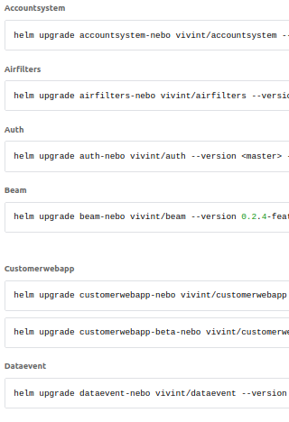

# Automatic Deployments Relieve Pain and Suffering

## Vivint's Deployment Pains and how Kubernetes, Helm, Helmfile, and Codefresh made deployments easy(er)

https://bit.ly/3aNIiZq

---
# **Automatic Deployments**

---

# **Relieve Pain and Suffering**

---

# Vivint's Deployment Pains and how

- Kubernetes
- Helm
- Helmfile,
- and Codefresh

...made deployments easy(er)

---

# Ben Mathews

ben@mathews2000.com
ben.mathews@vivint.com
https://github.com/benmathews/SLCKubernetesPresentation
https://bit.ly/3aNIiZq

I play with the latest CNCF toys.

---

# Plan

- 20 minutes of talking
- 15 minutes of demos
- Questions

---

# Who is Vivint (Business)

- We are public now! VVNT
- A leading smart home company in North America
- An integrated smart home system w/ security monitoring
- More than 1.5 million customers

---

# Who is Vivint (Technical)

- 40 Node Kubernetes self hosted cluster
- 140+ Deployments, Daemonsets, Statefulsets, Cronjobs
- 2K+ pods
- 17K (25K peak) messages / second from homes
- 5K messages/second in mobile traffic
- Multiple releases a week

---

# Manual VMs

## 2017

- Large installation of VMs
- Deployment was a 3-4 hour, completely manual process
- Problems
- Pain

<!-- Problems - draining nodes, hot patching, pets vs cattle -->

---

# Manual Kubernetes

## Jan 2018

- Jan 2018 - First Kubernetes in production
- Early 2019 - shut down the last of the old VM infrastructure

<!-- Long process to break all the hard coded paths and other assumptions -->

---

# Manual Kubernetes

## Great

- Deployment faster - under an hour
- More reliable
- Scheduling
- Restart failed processes
- Resource caps
- All the great K8S stuff

---

# Manual Kubernetes

## But

- But still manual
- Numerous mistakes
  - Wrong image tag
  - Forgetting to add new ENV parameters
  - Etc.

---

# Manual Kubernetes is a maintenance nightmare

- Hand editing YAML configs
- Syncronizing similar deployments across beta and production
- Wanted multiple dev and QA environments
  - Impossible w/ handcrafted YAML

---

# Helm

- Config as code
- Updates/Rollbacks
- Templating

---

# Helm public charts

---

# Helm demo

- helm create
- helm template
- helm deploy
- helm rollback
- helm history

---

# Helm

## 2018/2019

## Great

- Faster - half hour
- Deployments more reliable

---

# Late 2019

Finished converting everything to deploy with Helm charts

## But

- Still manual deployments
- Still mistakes

<!-- Mostly automated process also mean you can break production more completely and do it quickly. We once deployed to production with the beta configuration. It didn't go well. -->

---

# Helmfile

- Alpha
- Not many stars
- No website
- But it works
  - Really well

- Closed the config as code loop

<!-- Dustin Van Buskirk suggested Helmfile -->
<!-- I wrote a script to pull in our existing values files and had it working within days. The hardest part was training our QA staff that drive our release process. -->

---

# Helmfile demo

- Simple example
- Vivint production example

## Commands

- diff
- apply
- template

---

# Vivint Deployments - Helmfile - Late 2019

## Great

- Faster - 5 minutes
- Deployments more reliable

---

# Vivint Deployments - Helm - Late 2019

(Jumping back to our Helm status)

## But

- Manual workflow
  - Editing wiki pages
  - Slack messages
  - Miscomunication and mistakes == deployment mistakes and outages
- Still too slow

---

# Product Research

- Identified 40+ different CD products
- Reviewed them for
  - Ability to use existing Helm and Jenkins work
  - Logging and Audit trails
  - Okta, Bitbucket Server integration
  - GitOps style
  - Ease of use

---

# The winners

- ArgoCD
- FluxCD
- CodeFresh

---

# Codefresh pipeline

- Access control
- Audit logs
- Repeatable, scriptable workflow
- Flexible

---

# Working on

- Helm3
- Liveness & readiness probes
- Helm test
- Breaking up helmfile monolith

---

